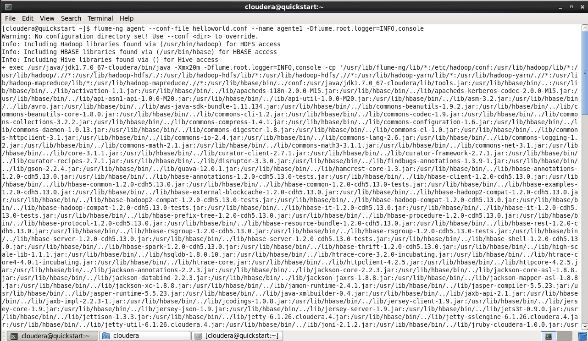
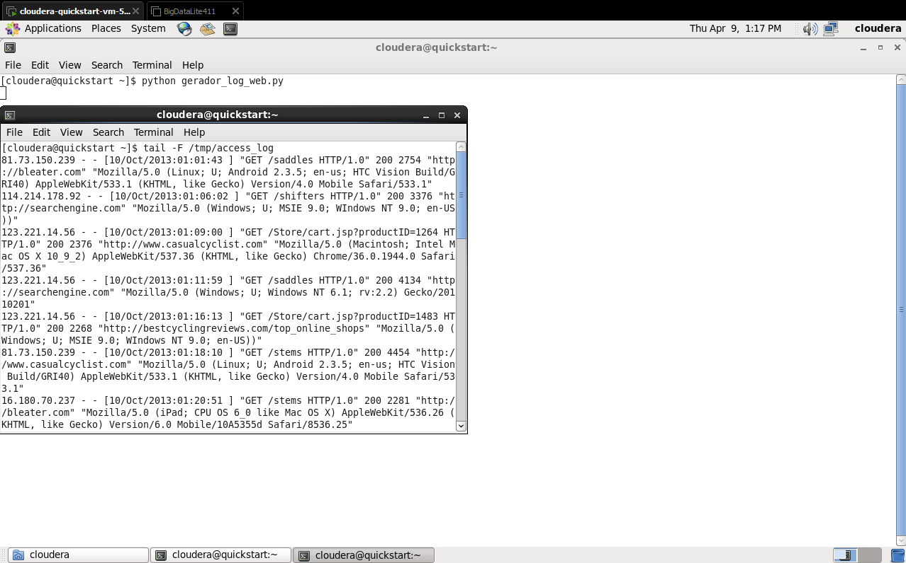
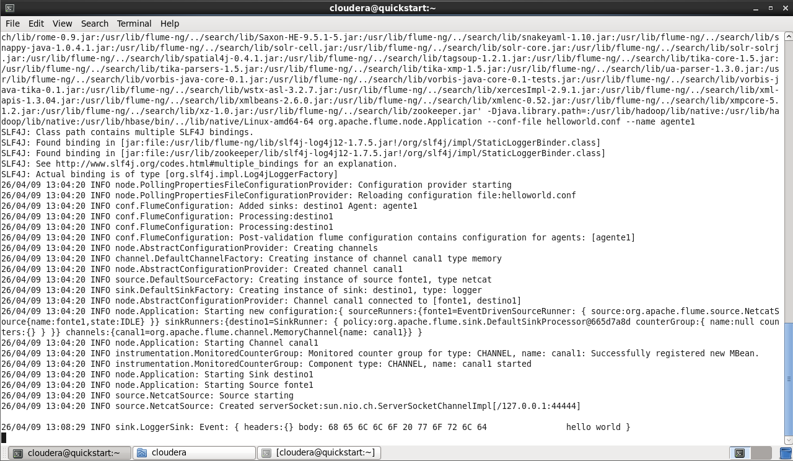

# 🚀 Pipeline de Ingestão de Streaming: Apache Flume, Avro & HDFS

Este projeto demonstra a construção de um pipeline de dados robusto para ingestão de logs em tempo real. A arquitetura utiliza múltiplos agentes do **Apache Flume** para capturar, filtrar e serializar dados de streaming, persistindo-os de forma otimizada em um Data Lake **Hadoop (HDFS)**.

## 📋 Cenário do Projeto
Simulação de um ambiente de produção onde logs de servidores web precisam ser monitorados. O objetivo principal foi isolar e armazenar apenas os rastros de um endereço IP específico (**16.180.70.237**) para fins de auditoria de segurança, utilizando serialização **Avro** para máxima performance.

## 🛠️ Tecnologias e Ferramentas
* **Python**: Gerador de logs sintéticos para simulação de streaming.
* **Apache Flume**: Orquestração e movimentação de dados.
* **Apache Avro**: Protocolo de serialização binária.
* **HDFS (Hadoop)**: Armazenamento distribuído (Data Lake).
* **Hue**: Auditoria visual dos dados armazenados.

---

## 🏗️ Arquitetura do Pipeline
A solução foi desenhada em uma topologia de duas camadas (**Multi-agent Tiered Architecture**):

### 1. Agente Coletor (`agenteavro`)
* **Source**: Captura contínua via `ExecSource` (comando `tail -F`).
* **Interceptor**: Filtro por Expressão Regular (**Regex**) para captura seletiva de dados.
* **Sink**: Serialização e transmissão via protocolo **Avro** para reduzir o overhead de rede.

### 2. Agente de Escrita (`agentehdfs`)
* **Source**: Receptor Avro na porta TCP **44444**.
* **Sink**: Persistência no HDFS com nomenclatura personalizada para linhagem de dados.

---

## 🚀 Passo a Passo da Implementação

### 1. Preparação do Data Lake
Criação do diretório de destino no HDFS com as permissões adequadas:

```bash
sudo -u hdfs hadoop fs -mkdir /user/datalake/raw
2. Configuração do Fluxo (Interceptors & Avro)
No arquivo agenteavro_hdfs.conf, implementamos o interceptor para filtrar o IP alvo e definimos o prefixo dos arquivos filtrados:

Properties
# Filtro de IP no Agente Coletor
agenteavro.sources.ft.interceptors = e1
agenteavro.sources.ft.interceptors.e1.type = regex_filter
agenteavro.sources.ft.interceptors.e1.regex = 16.180.70.237
agenteavro.sources.ft.interceptors.e1.excludeEvents = false

# Prefixo de arquivo no Agente HDFS
agentehdfs.sinks.dt.hdfs.filePrefix = filter_log_web
3. Execução dos Agentes
Para garantir a integridade, o agente receptor (HDFS) foi iniciado antes do emissor (Avro):

Bash
# Terminal 1 - Receptor (Iniciar primeiro)
sudo flume-ng agent -n agentehdfs -f agenteavro_hdfs.conf

# Terminal 2 - Emissor (Iniciar segundo)
sudo flume-ng agent -n agenteavro -f agenteavro_hdfs.conf
📊 Evidências de Resultados
Visualização no HDFS
Os logs foram processados e armazenados com sucesso, conforme listagem do sistema de arquivos distribuído:

Comando: hadoop fs -ls /user/datalake/raw

Resultado: Arquivos gerados com o prefixo filter_log_web.

Auditoria via Hue
Utilizando a interface do Hue, foi possível validar que os arquivos contêm exclusivamente o tráfego do IP filtrado e estão corretamente serializados em formato binário, garantindo a integridade da regra de negócio aplicada.

🎓 Conclusões Técnicas
Este projeto valida conceitos críticos de Engenharia de Dados, como:

Data Quality: Filtragem de dados on-the-fly para economia de storage.

Performance: Uso de formatos binários (Avro) em vez de texto puro para otimizar o tráfego de rede.

Resiliência: Gerenciamento de múltiplos processos e portas de rede em ambiente Linux/Cloudera.
```

Evidencias de Execução

Esta imagem mostra o momento em que executei o comando para subir o agentel utilizando o arquivo de configuração helloworld.conf. É possível notar o Flume carregando as bibliotecas do Hadoop e HBase, preparando o ambiente para a execução.


O motor do projeto. Esta imagem mostra o script Python gerador_log_web.py rodando e gerando logs em tempo real. No terminal menor, executei um tail -F para provar que o arquivo /tmp/access_log estava sendo populado continuamente com acessos simulados. Note a variedade de IPs e datas.


Esta é a evidência final do teste básico. O log do Flume (LoggerSink) capturou o evento e imprimiu no console a mensagem "hello world" que enviei via netcat, provando a integridade do fluxo Fonte -> Canal -> Sink.

